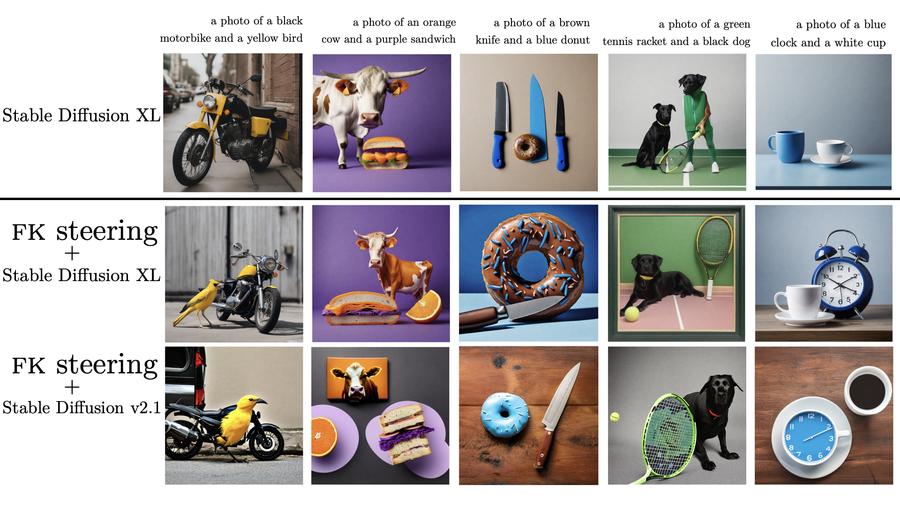
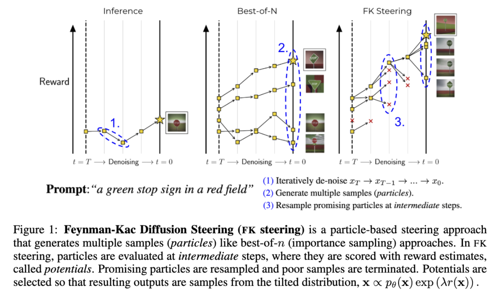
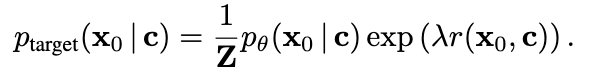
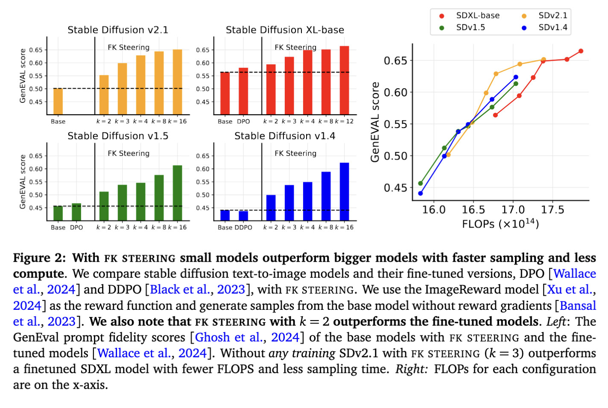
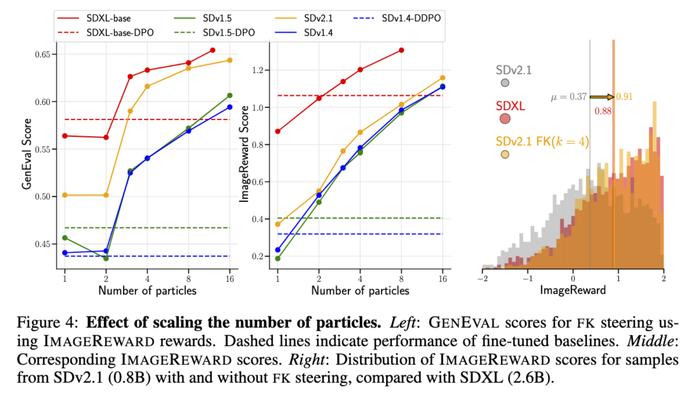
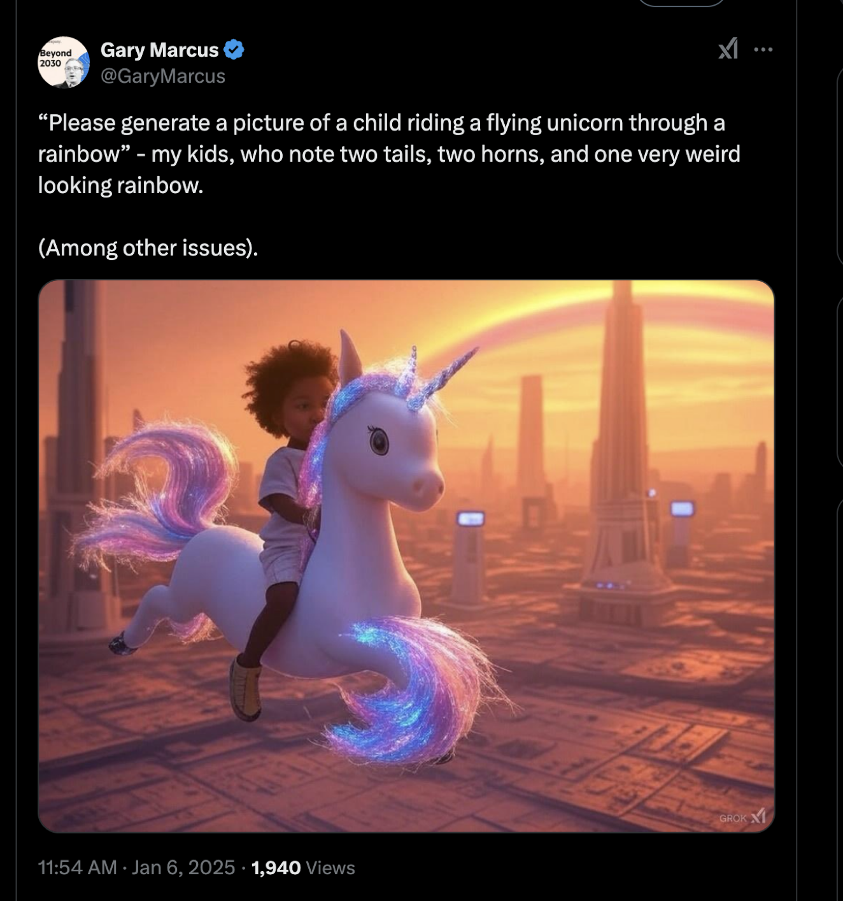
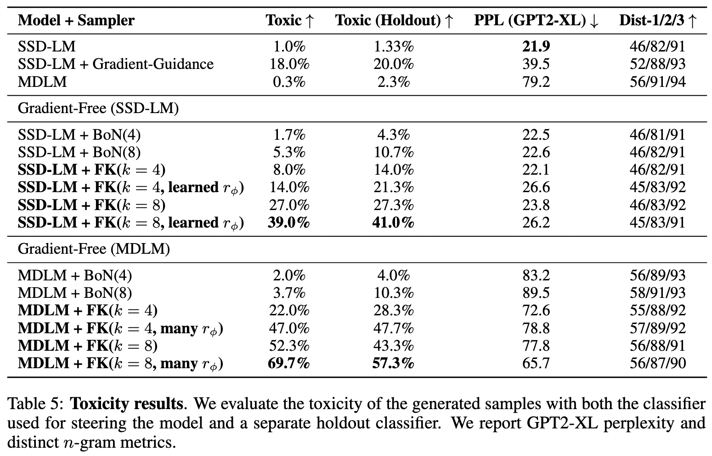

<div align="center">
    <h1>:dart: Feynman-Kac Diffusion Steering 🚀 📈 🌈</h1>
    <h3><i>A general framework for inference-time scaling and steering of diffusion models with arbitrary rewards.</i></h3>

[](https://arxiv.org/abs/2501.06848)

</div>

<div align="center" style="border: 2px solid black; display: inline-block;">
    
</div>

# Overview

**TLDR**: FK steering is a particle-based framework for steering diffusion models to generate high-reward samples. 

### With FK Steering, you can:

- Steer continuous or discrete diffusion models, even without computing gradients.
- Improve sample quality using human preference scores and sample quality metrics, even with off-the-shelf reward models.
- Make *smaller models* outperform *larger fine-tuned models*, using *less compute*.
- Generate samples with very rare attributes.

---

## How It Works

<div align="center" style="border: 2px solid black; display: inline-block;">
    
</div>

### 1. What is steering?

Steering focuses on generating samples with **high user-defined rewards**, such as:

- Human preference scores
- Likelihoods
- Vision-language model outputs
- Non-differentiable constraints

It’s up to you to define what “reward” means!

<div align="center" style="border: 2px solid black; display: inline-block;">
    
</div>

### 2. What is FK Steering?

High-reward samples are often rare under a standard model. FK Steering uses a **rare-event simulation framework** called FK-IPS to make such events more likely:

1. **Generate multiple diffusion processes**, called particles.
2. **Score particles** using potential functions defined by intermediate rewards.
3. **Resample particles** based on their potential at **intermediate steps**.

By scoring and resampling during generation, particles are steered toward high-reward outcomes.

### 3. Selecting potentials and rewards

Potentials are user-choices and are defined using intermediate rewards and up-weight trajectories that yield high reward particles. We provide several choices of potentials and rewards, learned and off-the-shelf. 
Our experiments showcase the trade-offs between these choices, so you can pick what works best for your goals. However, we also identify choices that work off-the-shelf, requiring no training. 

---

# Highlights

### Improves Sample Quality for Image and Text Diffusion Models

<div align="center" style="border: 2px solid black; display: inline-block;">
    
</div>

<div align="center" style="border: 2px solid black; display: inline-block;">
    
</div>

### Diffusion models can struggle with prompt adherence...

<div align="center" style="border: 2px solid black; display: inline-block;">
    
</div>

### ...but FK Steering can help!

<div align="center" style="border: 2px solid black; display: inline-block;">
    
</div>

---

## Enables Gradient-Free Control of Rare Attributes

FK Steering is versatile, enabling the generation of rare attributes even without gradient guidance. For example:

- **Toxicity Steering**: Increase a text diffusion model's toxicity rate from **0.3%** to **69.7%** with only 8 particles, outperforming both gradient guidance and best-of-n techniques. Unlike gradient-guidance for text diffusion models, FK Steering does not consistently increase perplexity.

This capability is valuable for tasks like **red-teaming**, steering models for **responsible AI**, and fine-tuning.

<div align="center" style="border: 2px solid black; display: inline-block;">
    
</div>

---

# Structure

- Text-to-Image Diffusion: See [**text_to_image**](./text_to_image).
- Discrete Text Diffusion: See [**discrete_diffusion**](./discrete_diffusion).

# Citation

```bibtex
@misc{singhal2025generalframeworkinferencetimescaling,
      title={A General Framework for Inference-time Scaling and Steering of Diffusion Models}, 
      author={Raghav Singhal and Zachary Horvitz and Ryan Teehan and Mengye Ren and Zhou Yu and Kathleen McKeown and Rajesh Ranganath},
      year={2025},
      eprint={2501.06848},
      archivePrefix={arXiv},
      primaryClass={cs.LG},
      url={https://arxiv.org/abs/2501.06848}, 
}
